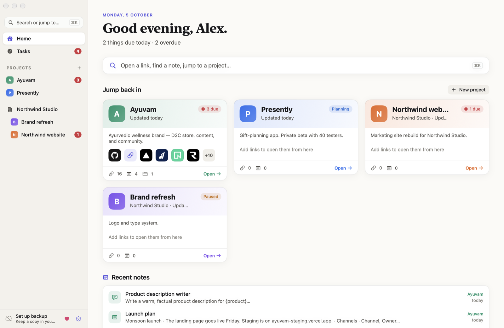
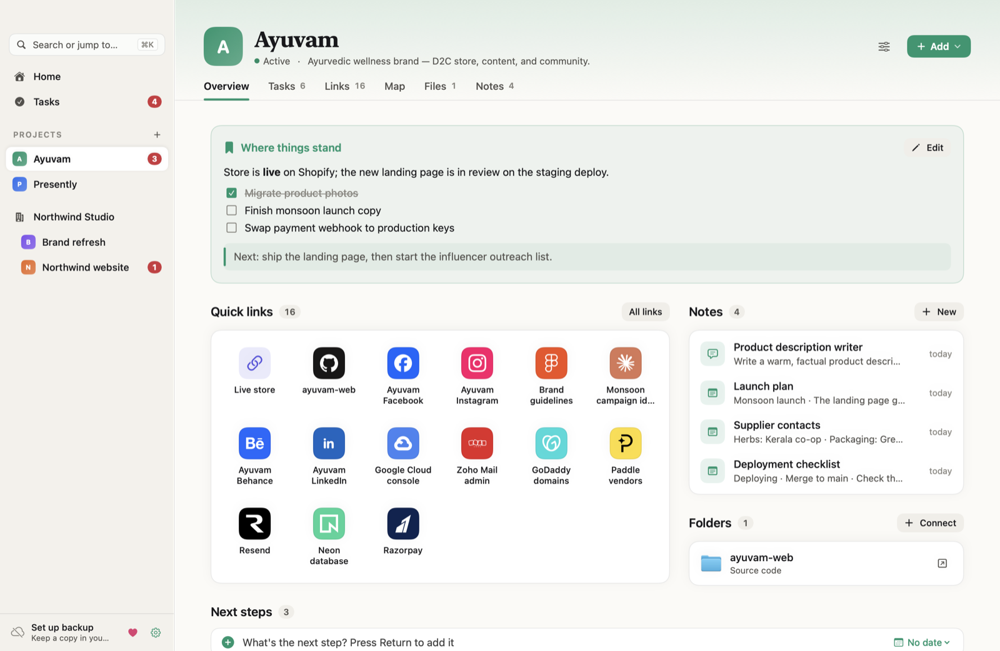
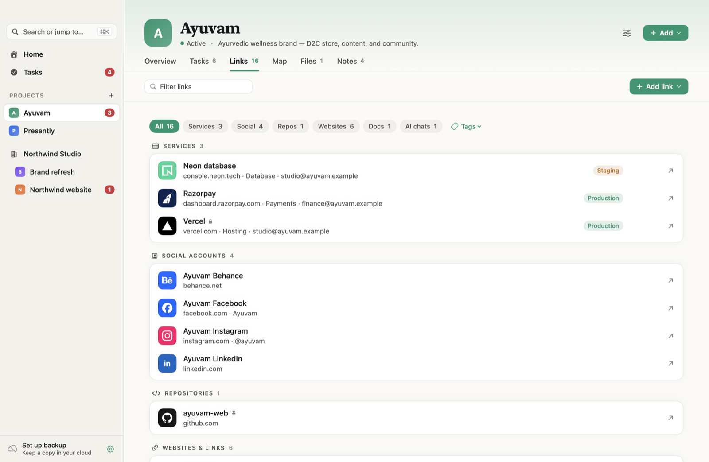
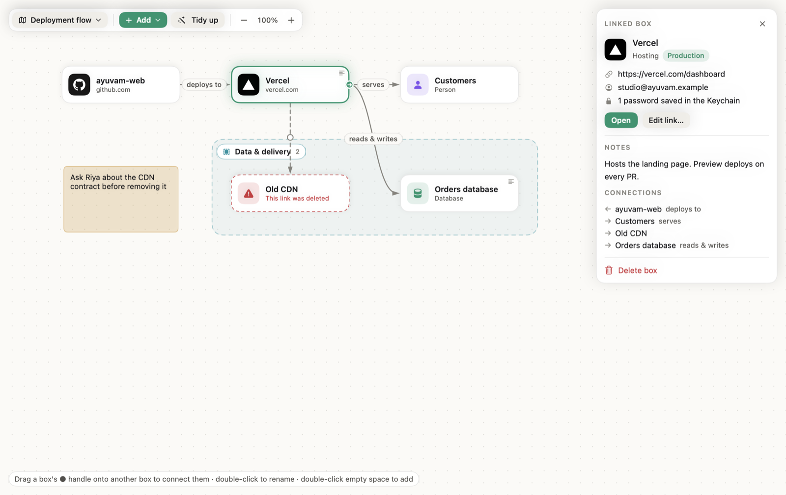
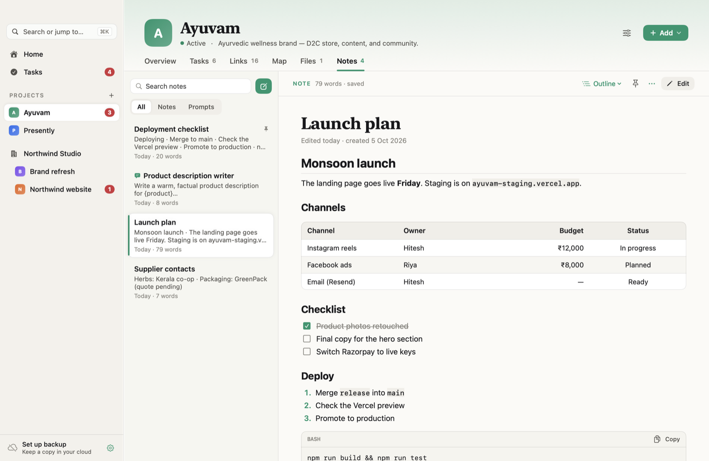
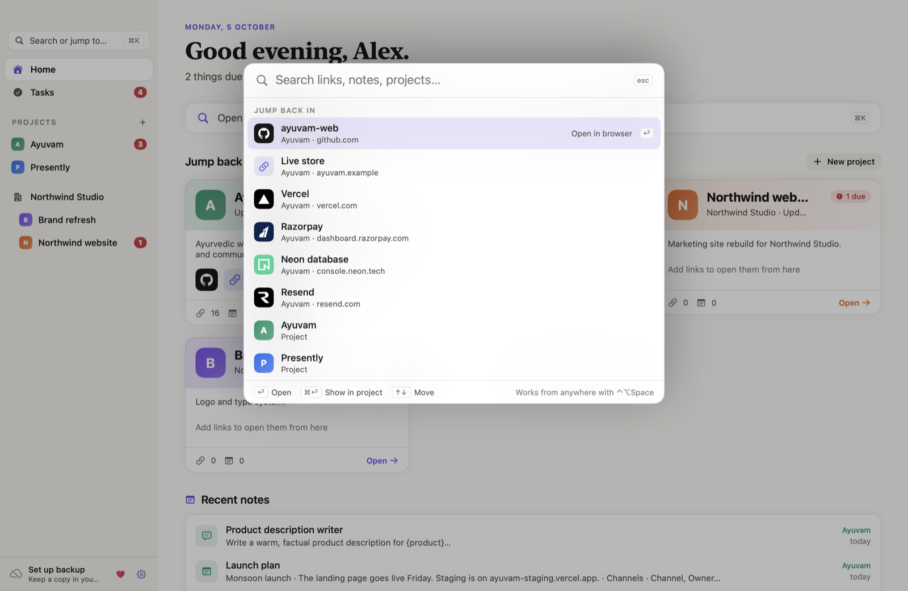
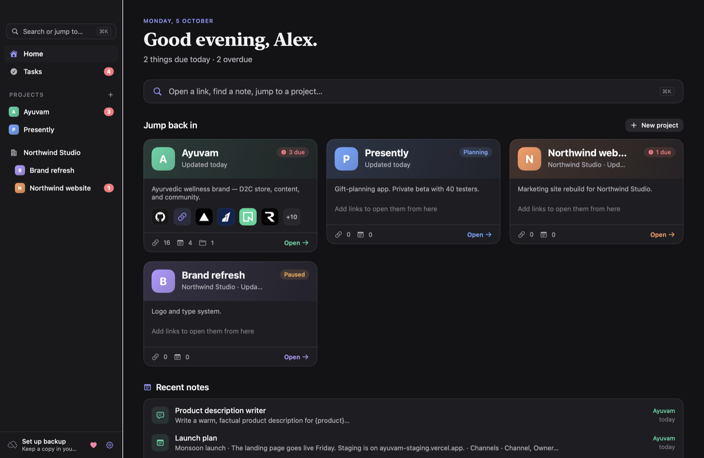

<div align="center">

# Context

**Pick up any project after weeks away, in seconds.**

A free, native Mac app that keeps everything around your projects in one place: the links, logins, notes, files, tasks, and how it all connects.
No account, no server, no subscription. Your data stays on your Mac.

[](../../releases/latest)
[](LICENSE)
[](Sources/Context)
[](https://ko-fi.com/hiteshgupta)

[Website](https://hiteshldt.github.io/context/) · [Download](../../releases/latest) · [Build from source](#build-from-source) · [♥ Support](https://ko-fi.com/hiteshgupta)



</div>

## Why

You come back to a side project, a client job, or your own product after 20 days and spend the first hour rebuilding it from memory. Which Vercel account was it? Where's the Figma file? What was I about to do next? Which ChatGPT thread had the pricing idea?

Context remembers that for you. Each project gets one page with its links, notes, folders, next steps, and a short "where things stand" note to your future self.

## Features

- **⌘K to open anything.** Type "neon", "vrcl", or "gc" for Google Cloud and press Return to open the link. It also works from any app with ⌃⌥Space and from the menu bar. The links you use most rise to the top.
- **One page per project**, with six tabs you can rename, reorder, or hide:

  | Tab | What it's for |
  | --- | --- |
  | Overview | "Where things stand", quick-link tiles, recent notes, folders, and next steps. After a week away it says welcome back. |
  | Tasks | To-dos with due dates, repeats, reminders, and snooze, plus social posts ticked off per platform. |
  | Links | Services, social accounts, repos, websites, docs, and AI chats, with their real logos (100+ brands). |
  | Map | A diagram of how the project's people, apps, and services connect. It can be built from your links in one click. |
  | Files | Your existing folders, browsed in place with previews. Nothing is copied, moved, or deleted. |
  | Notes | Markdown notes and reusable prompts with tables, checklists, code blocks with Copy, and autosave. |

- **Passwords go in the macOS Keychain**, not in Context's data. Revealing one needs Touch ID, and a copied password clears from the clipboard after 45 seconds.
- **Optional app lock.** Require Touch ID or your Mac password to open Context, with auto-lock when you step away (⚙ → Require Touch ID to Open).
- **Backup to iCloud Drive, Google Drive, Dropbox, or OneDrive** through their Mac apps. Context writes a dated copy after each change and keeps 30 days.
- **Clients**: group several projects under one client and see all their pending work together.
- **Light and dark mode**, keyboard-first, with zero third-party dependencies.

<table>
<tr><td></td><td></td></tr>
<tr><td></td><td></td></tr>
<tr><td></td><td></td></tr>
</table>

## Install

1. Download `Context.zip` from the [latest release](../../releases/latest) and unzip it.
2. Move **Context.app** to your Applications folder.
3. The first time, **right-click the app → Open → Open**. Context is free and not notarized by Apple, so macOS asks once.

Requires macOS 14 Sonoma or later. The download is built for Apple silicon; on an Intel Mac, build from source below.

### Build from source

You need Apple's Swift command-line tools (`xcode-select --install`).

```sh
git clone https://github.com/Hiteshldt/context.git
cd context
zsh scripts/build-app.sh --install   # builds, copies to /Applications, and opens it
```

## Map

- **Start a map:** "Build from my links" lays out the project for you, or you can start blank.
- **Box types:** Person, App, API, Database, Storage, Cloud, Email, Payment, Step, and sticky notes. A box linked to a saved link shows that link's logo and follows its renames. If the link is deleted, the box is flagged.
- **Details on one click:** click a box to see its notes, URL, account, environment, and connections. Plain boxes have their own notes; boxes with notes show a small ≡ marker, and hovering previews them.
- **Groups:** Add → Group draws a labelled frame. Drag boxes in, drag the name tag to move the group with everything inside, and drag the corner to resize. Right-click a box → Put in a New Group to frame it.
- **Connect boxes:** drag a box's ● handle onto another box. Click a connection to label it, dash it, reverse it, or delete it.
- **Edit:** double-click empty space to add a box, double-click a box to rename it, and press **Tidy up** to arrange everything into columns.

## Keyboard shortcuts

| Shortcut | Action |
| --- | --- |
| ⌘K | Search and jump to anything |
| ⌃⌥Space | Same, from any app |
| ⌘N | New note in the current project |
| ⌘T | New task |
| ⇧⌘N | New project |
| ⌘1 | Home |
| ⌘E | Read / edit the current note |
| ⌘B · ⌘I | Bold · italic while editing |
| ⌘F | Find inside a note while editing |
| ⇧⌘B | Back up now |
| ⇧⌘E | Export a backup file |
| ⌃⌘L | Lock Context (when the app lock is on) |

## Privacy and your data

Context has no telemetry, no analytics, and no sync service of its own. Its only network use:
- opening the links you click, and
- fetching website icons once for links without a built-in logo. You can turn this off in ⚙.

```text
~/Library/Application Support/Context/workspace.json           your data
~/Library/Application Support/Context/workspace.previous.json  the previous save
~/Library/Application Support/Context/backup-settings.json     where backups go
```

These files are readable only by your Mac account but are not encrypted, so keep passwords in a link's Keychain credentials rather than in notes. The optional app lock keeps Context's windows, launcher, and menu bar panel closed until you unlock; it does not encrypt the files on disk.

Backups include projects, links, notes, prompts, tasks, posts, and maps. They don't include the files in connected folders, which stay where they are, or Keychain passwords. Restoring always asks first and keeps a copy of your current data.

## Development

```sh
zsh scripts/test.sh        # data, recurrence, migration, Markdown, map layout, launcher, backup, and brand-icon tests
zsh scripts/build-app.sh   # builds dist/Context.app
zsh scripts/snapshot.sh    # renders every screen with demo data (never your data) to .build/snapshots/
```

To try it with a throwaway data folder: `CONTEXT_DATA_DIR="$PWD/.build/manual" dist/Context.app/Contents/MacOS/Context`.

The code is plain SwiftUI and AppKit in `Sources/Context`. The original product spec is in [PRODUCT_SPEC.md](PRODUCT_SPEC.md). Issues and pull requests are welcome.

## Support

Context is free and always will be. If it saves you time, you can buy me a coffee. ♥

[](https://ko-fi.com/hiteshgupta)

Starring the repo ⭐ or telling a friend helps too.

## License

[MIT](LICENSE). Brand icons come from [Simple Icons](https://simpleicons.org) (CC0). Brand names and logos belong to their owners and are used only to label your saved links.
